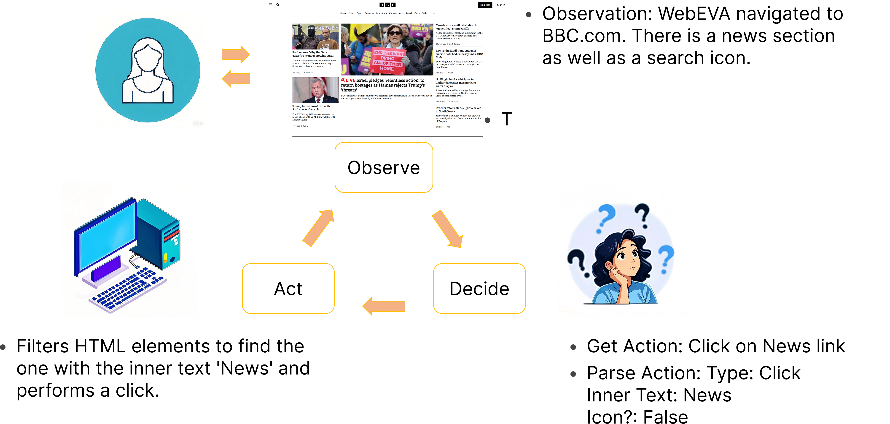

<div align="center">
<h1> WebEVA 
<br>The Next Impact Toward Smarter Web Agents </h1>
</div>

<div align="center">


</div>

<div align="center">

</div>

## Description

WebEVA is a multimodal web agent that achieves a state-of-the-art 80.3% success rate on the WebVoyager dataset by improving element selection, task refinement, and efficient navigation.
[Prompts](https://github.com/brotherspavel/WebEVA/blob/main/messages.js)

## Prerequisites

Before running the project, make sure you have **Node.js** installed. You can download it from [Node.js official website](https://nodejs.org/).

Additionally, you will need a `.env` file to store your environment variables securely.

## Setup

Follow these steps to set up the project:

1. **Clone the repository**:

   ```bash
   git clone https://github.com/brotherspavel/WebEVA
   cd WebEVA
   ```

2. **Install dependencies**:
   Install the required Node.js packages:

   ```bash
   npm install
   ```

   Install Playwright and its required browsers:

   ```bash
   npx playwright install
   ```

3. **Create the `.env` file**:
   In the root of the project, create a .env file with the following environment variables:

   ```bash
   model="gpt-4o"
   OPENAI_API_KEY=YOUR_OPENAI_API_KEY
   OPENAI_API_URL=YOUR_OPENAI_API_URL
   ```

   Replace `YOUR_OPENAI_API_KEY` and `YOUR_OPENAI_API_URL` with your actual OpenAI API credentials.

## Running the Project

Once the setup is complete, you can run the script by providing the task description as a command-line argument.

### Example Usage:

```bash
node index.js "Find the last composition by Mozart and play it on YouTube"
```

If the task requires interaction with a particular website (like WebVoyager tasks), provide the website URL:

```bash
node index.js "Find the last composition by Mozart" "https://example.com"
```
